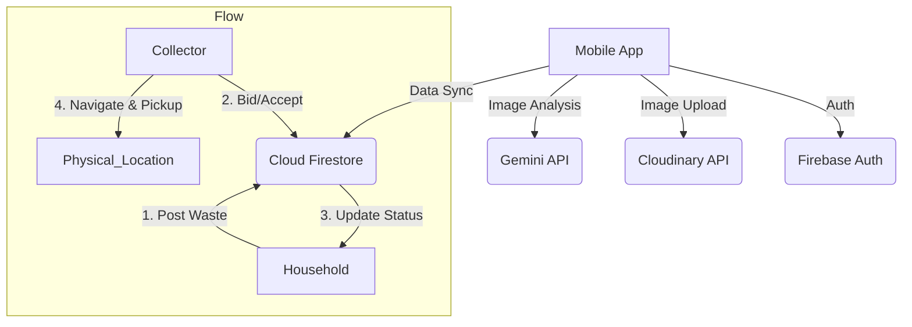

# 🌱 EcoConnect: AI-Powered Waste Management System

**EcoConnect** is a cross-platform mobile application built with **Flutter** that bridges the gap between households (waste sellers) and local scrap collectors (buyers). It leverages **Generative AI** to identify waste items and estimate their value, facilitating a transparent and efficient recycling economy.

**Video Link**: https://drive.google.com/file/d/19Fta2pcX7G6Yt_B6qj2nCHvAHPXO3ZPd/view?usp=sharing

---

## 📱 Features

### 🏠 For Households (Sellers)
- **AI-Powered Scanning:** Snap photos of waste (plastic, metal, e-waste). The app uses the **Gemini 2.5 pro** model to automatically detect the category and estimate a fair price.
- **Multi-Image Support:** Upload multiple angles of the items for better clarity.
- **Negotiation System:** Receive offers from collectors, accept, or reject them in real-time.
- **Activity Dashboard:** Toggle between ongoing negotiations and completed history.
- **Rating System:** Rate collectors based on fair payment and behavior.

### 🚚 For Collectors (Buyers)
- **Marketplace Feed:** View nearby waste selling requests sorted by distance.
- **Smart Bidding:** Accept the asking price or "Make an Offer" to negotiate.
- **Navigation:** Integrated with Google Maps to navigate to the household's location.
- **Job Management:** Track "Active Jobs" and manage payments.
- **Profile & Stats:** View earnings history and user ratings.

---

## 🛠️ Tech Stack

- **Frontend:** Flutter (Dart)
- **Backend:** Firebase (Authentication, Firestore)
- **AI/ML:** Gemini API Key
- **Image Storage:** Cloudinary
- **Location:** Geolocator & Google Maps URL Scheme
- **State Management:** `setState` & Streams

---

## 🏗️ Architecture & Workflow

The application follows a cloud-native architecture connecting mobile clients to AI and Database services.



## 🚀 Installation & Setup

Follow these steps to run the project locally.

### 1. Prerequisites
- [Flutter SDK](https://docs.flutter.dev/get-started/install) installed.
- A **Firebase Project** created on the [Firebase Console](https://console.firebase.google.com/).
- API Keys for **Cloudinary** and **OpenRouter**.

### 2. Clone the Repository
```bash
git clone https://github.com/your-username/eco-connect.git
cd eco-connect
```
### 3. Install Dependencies
```bash
flutter pub get
```

### 4. Install Dependencies
<b>Important</b>: This project uses flutter_dotenv to manage secrets.
1. Create a file named .env in the root directory of the project.
2. Add the following keys to the file:
```bash
# Cloudinary Configuration
CLOUDINARY_CLOUD_NAME=your_cloud_name
CLOUDINARY_UPLOAD_PRESET=your_upload_preset

# AI Configuration (Gemini)
GEMINI_API_KEY=your_openrouter_api_key

# Google Auth (Web Client ID from Firebase Console)
GOOGLE_CLIENT_ID=your_web_client_id
```

### 5. Install Dependencies
Run the standard FlutterFire configuration command to link your local app to your Firebase project:
```bash
flutterfire configure
```

### 6. Run the App
Run the standard FlutterFire configuration command to link your local app to your Firebase project:
```bash
flutter run
```
